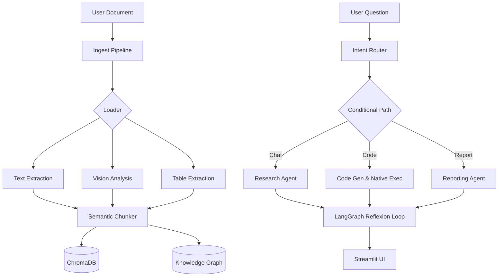

# ☁️ Cloud-Native Multi-Agent RAG Platform

A lightning-fast, multi-agent Retrieval-Augmented Generation (RAG) system powered by **Groq**, **LangGraph**, and **ChromaDB**. It transforms your documents (PDF, Markdown, Text) into a searchable, interactive knowledge base with built-in Knowledge Graph extraction and hallucination protection.

---

## ⚡ Features & Modes

The system uses a Multi-Agent State Machine (LangGraph) to intelligently route your questions:

| Mode | Feature | Details |
|---|---|---|
| 💬 **Chat** | **Smart RAG** | Semantic retrieval using `all-MiniLM-L6-v2` with exact citations. |
| 🔢 **Code** | **Data Analysis** | Generates and executes native Python code for precise calculations. |
| 📊 **Vision** | **Visual Analysis** | Analyzes charts, diagrams, and images within your documents. |
| 📝 **Report** | **Workspace Audit** | Generates comprehensive markdown summaries of your project folder. |
| 🗃️ **Graph** | **Knowledge Graphs** | Interactive physics-based network visualization of your data. |

---

## 🏗️ Architecture



---

## 🛠️ Tech Stack

### Core Engine
- **Language:** Python 3.11+
- **UI:** Streamlit (Animated Glassmorphism Interface)
- **Orchestration:** LangChain + LangGraph (Multi-Agent State Machine)
- **Vector Database:** ChromaDB 
- **Graph Database:** NetworkX + PyVis

### AI Models (Cloud Native)
- **Text:** `Llama 3.3 70B` (via Groq Cloud)
- **Vision:** `Llama 3.2 11B Vision` (via Groq Cloud)
- **Embeddings:** `all-MiniLM-L6-v2` (Sentence-Transformers)

### Processing Tools
- **PDF:** `pypdf`, `pypdfium2`, `Camelot`, `PaddleOCR`
- **Markdown/Docs:** `Unstructured`, `python-docx`

---

## 🚀 Getting Started

### 1. Prerequisites
- **Groq API Key:** Get a free API key from [Groq Console](https://console.groq.com)
- **Python:** 3.11+

### 2. Installation
```powershell
# Clone and enter directory
git clone <repo-url>
cd "Cloud-Brain-Knowledge-System"

# Install dependencies
pip install -r requirements.txt

# Setup Environment
copy .env.example .env
# Edit .env to set your GROQ_API_KEY
```

### 3. Running the App
```powershell
streamlit run frontend/app.py
```
Open **http://localhost:8501** in your browser.

---

## ⚡ Performance & Cloud Power

- **Groq Cloud Integration:** Ultra-fast LPU inference speeds for text and vision processing.
- **Incremental Indexing:** Built-in hashing skips unchanged files, re-indexing in seconds.
- **Native Python Execution:** Lightning-fast, self-correcting data analysis directly within the RAG loop.

## 📁 Project Structure

```text
├── frontend/
│   └── app.py               # Streamlit Frontend UI
├── backend/
│   ├── config.py            # System Settings & LLM Config
│   ├── llm_provider.py      # LLM factory (Groq integration)
│   ├── agents/              # LangGraph Agent logic (Researcher, Grader, Router)
│   ├── brain/               # Core RAG engine (Loader, Chunker, Vectorstore, Entity Extractor)
│   └── tools/               # External tool integrations (DB, File System)
├── database/
│   ├── chroma_db/           # Vector embeddings database
│   └── .brain_cache/        # Hashing and vision caches
└── tests/                   # Pytest suite
```
