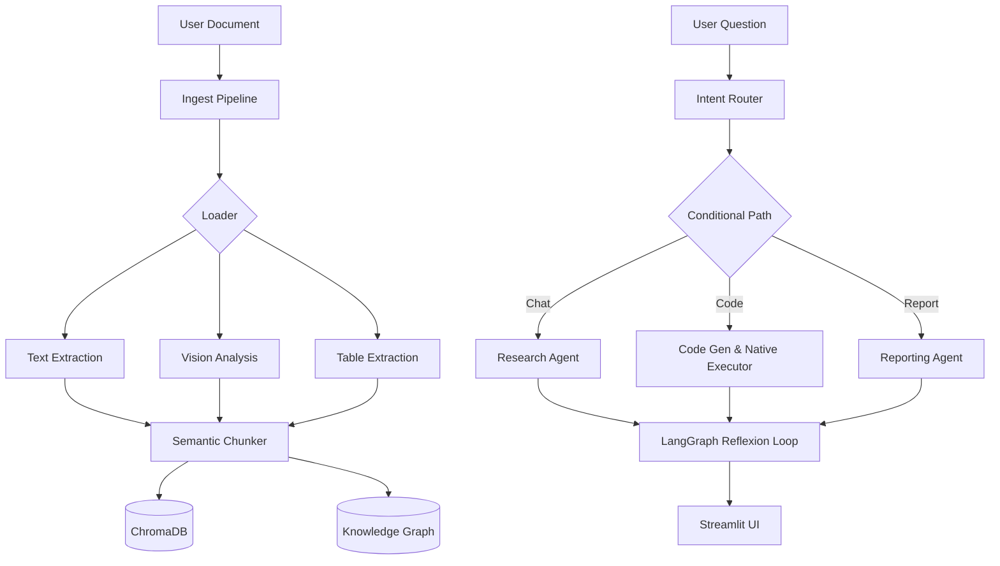

# ☁️ Cloud-Native Multi-Agent RAG Platform — Deep Explanation

> **Version**: 2.0 (Cloud-Native Migration)  
> **Author**: AI Engineer  

---

## Table of Contents

1. [Project Overview](#1-project-overview)
2. [Architecture Diagram](#2-architecture-diagram)
3. [Tech Stack](#3-tech-stack)
4. [Cloud System (Groq Mode)](#4-cloud-system-groq-mode)
5. [Agent System Architecture](#5-agent-system-architecture)
6. [Data Flow Pipeline](#6-data-flow-pipeline)
7. [Knowledge Graphs](#7-knowledge-graphs)
8. [Performance Optimizations](#8-performance-optimizations)
9. [How to Run](#9-how-to-run)

---

## 1. Project Overview

**Cloud-Native Multi-Agent RAG Platform** is an ultra-fast, cloud-powered document intelligence platform. It ingests folders of documents (PDF, TXT, MD), automatically chunks and indexes them into a vector database (ChromaDB), and extracts entities to build an interactive **Knowledge Graph**. 

The system routes natural language questions to a suite of intelligent agents:
- **Chat mode** → RAG-based text retrieval and summarization.
- **Code mode** → Native Python code generation and execution for math/statistics.
- **Report mode** → Automated workspace report generation.
- **Graph mode** → Interactive entity/relationship visualization.

The system runs **fully in the cloud** using Groq's LPU API for near-instant inference.

---

## 2. Architecture Diagram



---

## 3. Tech Stack

| Category | Technology | Purpose |
|---|---|---|
| **Language** | Python 3.11+ | Core application language |
| **UI Framework** | Streamlit | Web dashboard and chat interface |
| **LLM Orchestration** | LangChain / LangGraph | LLM abstraction & state machine |
| **Vector Database** | ChromaDB | Document embedding storage |
| **Graph Database** | NetworkX & PyVis | Entity relationship visualization |
| **Cloud Inference** | Groq API | Lightning-fast Llama-3 inference |
| **Embedding Model** | Sentence-Transformers | Semantic chunking |

---

## 4. Cloud System (Groq Mode)

The system uses **Groq's cloud inference** for dramatically faster responses. Groq uses custom LPU (Language Processing Unit) hardware that delivers 10-100x faster inference than traditional GPUs.

### Models Used

| Model | Provider | Speed | Purpose |
|---|---|---|---|
| `llama-3.1-8b-instant` | Groq | ~500 tok/s | Text chat, code generation, intent routing |
| `llama-3.2-11b-vision` | Groq | ~2-5s/img | Vision analysis (chart/image description) |
| `all-MiniLM-L6-v2` | HuggingFace | Local CPU | Embedding generation for semantic search |

### Pros of Cloud Mode
- **10-100x faster responses** compared to local CPU execution.
- **Instant Python Sandboxing** via native code execution.
- **Zero local GPU requirements**.

---

## 5. Agent System Architecture

The agent system uses **LangGraph** to implement a state machine with conditional routing.

### Graph Nodes

```text
START → route_intent → [conditional]
                          ├─ "chat"   → retrieve_and_draft → END
                          ├─ "code"   → code_exec          → END
                          ├─ "report" → reporting_node     → END
```

### Native Python Execution
The code executor securely bypasses slow external Docker containers. For generated math or statistical code, the system runs native Python execution locally, capturing `stdout` and `stderr` directly into the agent context in <1 second.

---

## 6. Data Flow Pipeline

### Document Indexing Flow
1. **Incremental Hash Check:** Computes MD5 hashes for files. Skips unchanged files.
2. **Text & Vision Loading:** Uses `pypdf` for text, `Camelot` for tables, and `llama-vision` for diagrams.
3. **Semantic Chunking:** Calculates cosine-similarity drops between sentences using `sentence-transformers` to split chunks by meaning, not character count.
4. **Graph Extraction:** Uses the LLM to extract entities and relations from chunks.
5. **Vector Storage:** Upserts embeddings into `ChromaDB`.

### Question Answering Flow
1. **Intent Routing:** Fast regex/LLM intent classification decides if the user wants math, a summary, or a workspace report.
2. **Retrieval:** Queries ChromaDB for the Top-K most relevant chunks.
3. **Execution:** The designated agent drafts a response (or writes and runs Python code).
4. **Display:** Renders the response in the UI with exact source citations mapped to the chunk metadata.

---

## 7. Knowledge Graphs

During ingestion, the **Entity Extractor** scans document chunks and identifies:
- **Entities:** Organizations, People, Metrics, Locations.
- **Relations:** How entities are connected (e.g., "Company X" -> "acquired" -> "Company Y").

This data is stored in a `NetworkX` graph structure and visualized interactively in the Streamlit UI using `PyVis`, allowing users to explore a physics-based web of their data.

---

## 8. Performance Optimizations

| Optimization | Impact |
|---|---|
| **Incremental Indexing** | Skip unchanged files → re-index in <3s. |
| **Disk Cache** | Vision/Table results cached → skips expensive AI calls on re-index. |
| **Parallel Processing** | 4-worker thread pool for file-level ingestion parallelism. |
| **Native Python Engine** | Math calculations complete in <1s with no Docker overhead. |
| **Semantic Chunking** | Prevents context loss by keeping related sentences together. |

---

## 9. How to Run

### Configuration (`.env`)
```env
GROQ_API_KEY=gsk_your_key_here
GROQ_MODEL=llama-3.1-8b-instant
GROQ_VISION_MODEL=llama-3.2-11b-vision-preview

CHROMA_PERSIST_DIR=./chroma_db
```

### Running
```bash
# Install dependencies
pip install -r requirements.txt

# Start the application
streamlit run app.py
```
